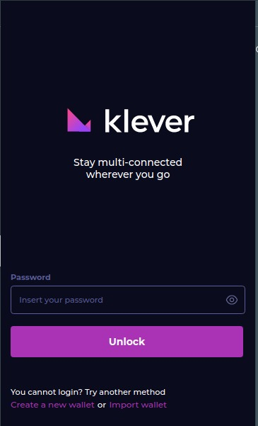
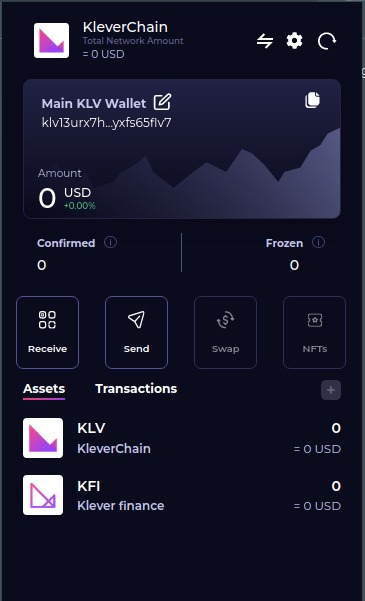
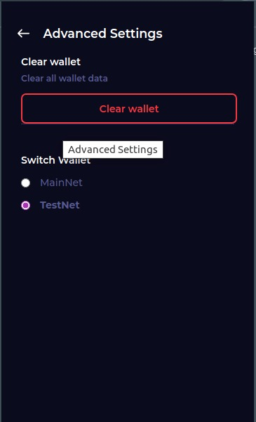

# 🔆 <strong>Boas vindas ao repositório do Hackathon T22!</strong>

### <strong>Sobre o projeto</strong>

<p align=center>
  
</p>

Esse projeto foi desenvolvido durante o Hackathon da [Klever Exchange](https://klever.io/en) junto com a [Trybe](https://www.betrybe.com/), ocorrido entre 10 e 11 de dezembro de 2022.

A aplicação é um jogo de apostas estilo _crash_, onde o jogador aposta uma quantia e deve optar pelo momento correto de parar a sua aposta, correndo o risco de perder tudo. Caso pare antes de o jogo dar _crash_, o jogador recebe o que apostou multiplicado pelo valor do jogo - quanto mais ele rodar antes de parar, maior o valor.

O jogo está integrado à extensão Klever Wallet, permitindo que o jogador utilize Klever (KLV) em sua carteira para comprar TrybeCoins e apostar. Também é possível jogar sem ter a extensão ou uma conta na Klever.

Feito em parceria com [@ArthurVianna96](https://github.com/ArthurVianna96), [@DanubioRafa](https://github.com/DanubioRafa), [@erik-ymmt](https://github.com/erik-ymmt) e [@ThiagoBarbosaDev](https://github.com/ThiagoBarbosaDev).

Os arquivos em que trabalhamos estão em `/kleverbet/src`. 

<strong>Minhas principais contribuições:</strong>
 - Hook customizado useWalletBalance (React Query)
 - Integração com a extensão Klever Wallet
 - Componente de Login
 - Lógica de Trybecoins
 - Notificações Toast
 - Parte do CSS

<details>
<summary><strong>Tecnologias utilizadas</strong></summary>

 - React
 - Typescript
 - React Query
 - React Hook Form
 - React Charts
 - Vite
 
</details>

<details>
<summary><strong>Detalhes do Hackathon<strong></summary>


## 🛑 <strong>Termos de uso</strong>
​
Ao iniciar este projeto, você concorda com as diretrizes do Código de Ética e Conduta e do Manual da Pessoa Estudante da Trybe.
​<br>


## 🚫 <strong>Regras </strong>
- Ao participar deste evento você concorda em:
> 01 - Respeitar o Código de Conduta da Trybe<br>
> 02 - Não violar os princípios de fair play<br>
> 03 - Não  pedir ou receber apoio de qualquer pessoa fora do evento<br>
> 04 -  É esperada a contribuição de todos os membros do grupo no desenvolvimento<br>
> 05 - Todos os membros do grupo devem, obrigatoriamente, estar na apresentação do projeto no dia 11/12.<br>
<br>

# <strong>📗 Sumário</strong>
- ## ☑️ [Entregáveis](#entregáveis)
  * [O que deverá ser desenvolvido](#o-que-deverá-ser-desenvolvido)
​<br><br>
- ## ☑️ [Como desenvolver](#como-desenvolver)
  * [A Klever Extension](#a-klever-extension)
  * [Criando sua Wallet na TestNet](#criando-a-wallet-na-testnet)
  * [Demonstração de conexão com extensão](#demonstracao-de-conexao-com-extensão)
  * [Data de entrega](#data-de-entrega)
  * [Sugestões de aplicações](#sugestões-de-aplicações)
​<br><br>
- ## ☑️ [Links Úteis](#links-uteis)
​
# 📝 Entregáveis
​

## `O que deverá ser desenvolvido`
<details>
<summary><strong>O desafio é desenvolver uma aplicação FrontEnd que utilize a Klever Browser Extension:</strong></summary>
​

- A extensão permite que os usuários listem suas transações, recebam fundos, gerenciem 
várias contas, gerem e redefinam suas contas e, mais importante, integrem-no ao
KleverChain Explorer para visualizar cada transação.
​
- Devido as facilidades que a Klever Extension nos entrega, o objetivo é utilizar a criatividade
para desenvolver soluções para nosso dia-a-dia em que o usuário possa utilizar a
extension.
<br>
</details>
​

## `A Klever Extension`
​<details>
<summary><strong>Como fazer o download da extensão</strong></summary>


Para efetuar o download da Klever extension:
```bash
1. Acesse a url: https://chrome.google.com/webstore/detail/klever-wallet/lmbifcmbofehdpolpdpnlcnanolnlkec
2. Certifique-se que está logado na conta gmail que você forneceu durante a inscrição para o Hackathon.
3. Crie seu login seguindo os comandos da extensão.
```
## Imagens da extensão

 

 

 
</details>

### :moneybag: Criando sua Wallet na TestNet
<details>
<summary><strong>Passo-a-passo de como criar a wallet e adcionar KLV para testes</strong></summary>


Após fazer o download da Klever Extention é hora de criar Wallet na TestNet:
1. acesse a seguinte url
```bash 
https://kapps-demo-testnet.web.app/connect
```
2. Clique em GENERATE NEW ACCOUNT e salve o arquivo .pem
3. Faça o upload do arquivo .pem salvo na mesma página e clique em REQUEST DAILY KLV
4. Acesse a Klever Extension e clique em IMPORT WALLET e siga os prompts
5. A partir daqui sua Wallet estará pronta para ser utilizada

!! Usuários de Linux: Você precisa clicar em inspecionar a extensão enquanto faz o upload do arquivo .pem


# :desktop_computer: Demonstração de conexão com extensão
</details>
<details>
<summary><strong>A Conexão com a Klever Extesion</strong></summary>


Esta demonstração serve para mostrar de forma prática como se conectar aos provedores suportados pela Extensão Klever 
```bash
https://github.com/tryber/klever-extension-demo
```
:warning: 
* Para que o objeto window.kleverWeb exista na página e necessário que a extensão KleverExtension esteja instalada no navegador e uma carteira associada a extensão.
* No caso de fazer request a API da klever sempre use a url com host testnet e não a mainnet.
* Você pode usar o pacote @klever/sdk ou @klever/kleverweb para aproveitar as a intelisense do vscode por causa da tipagem do pacote, em substituto ao objeto window.kleverWeb.
* Deve-se trocar o provider do objeto: window.kleverWeb para o nó e a api de testes, testweb. 
```bash 
await window.kleverWeb.setProvider({ node: ‘https://node.testnet.klever.finance’, api: ‘https://api.testnet.klever.finance’, });
```
* O erro GET https://api.testnet.klever.finance/v1.0/address/undefined 500, deve-se a carteira não estar logada, verifique clicando no ícone extensão e validando que a carteira foi criada e o password inserido.
</details>


### 📆 `Data de entrega`
<details>
- Data para entrega será no domingo (11/12) até as 14:59 horas.<br>
- As apresentações do projeto iniciarão às 15:00 do domingo. Serão aceitas apenas submissões feitas até às 14:59.

</details>


# Instruções para entregar seu projeto


## ‼ Antes de começar a desenvolver
<details>
- Faça o fork desse repositório
- Adicione @nato-re como colaborador com a `role` mainteiner no repositório de fork criado
- Leia atentamente o readme e tudo pronto para começar a desenvolver
</details>

## 🛠 Como desenvolver
​
Este repositório não conta com branches para cada grupo, e sim deve ser criado um repositório de fork.
O código final deve ficar na branch principal deste repositório. Portanto o código deve ser desenvolvido a partir do fork.
​
# **Sugestões** de aplicações
​
## ⚽️ Jogos

<details>
  <summary><strong>🤑 Mega-Sena </strong></summary><br />

- O jogador deve escolher 6 números dentre 60
- Deve ser feita uma transação para confirmar a aposta
- Com a aposta confirmada, exibir os números selecionados e executar o sorteio
- O usuário ganha se sair seus 6 números sorteados dentre os 60
- Caso tenha ganho, exibir para o usuário quanto ele ganhou e que uma
transação será feita com o valor
- Caso não ganhe exibir uma mensagem e uma opção para tentar novamente
</details>
<details>

  <summary><strong>🔖 Raspadinha </strong></summary><br />

- O jogador deve comprar uma raspadinha
- cada raspadinha possui 5 estrelas cinzas
- Deve ser feita uma transação para confirmar a compra
- Com a aposta confirmada, executar o sorteio
- O usuário ganha se sair 3 estrelas da mesma cor, teremos 3 possíveis cores
(azul, verde e amarelo)
- Caso tenha ganho, exibir para o usuário quanto ele ganhou e que uma
transação será feita com o valor
- Caso não ganhe exibir uma mensagem e uma opção para tentar novamente
</details>

<details>
  <summary><strong>🩳 Loja Virtual </strong></summary><br />

- Criar uma página com listagem de produtos
- Ao clicar em um produto deve ir para a página de detalhe do produto
- nome, images, descrição, valor, botão de compra
- Quando o usuário clicar para comprar, deve ser feita uma transação para confirmar a
compra
- Ao confirmar a transação deve exibir uma mensagem de confirmação de compra
</details>

<details>
  <summary><strong>🙏 Doação </strong></summary><br />

- Criar uma página para uma causa social instituição receber doação para uma causa
social
- imagens
- descrição e ações da causa
- quem apoia
- valor total já foi doado
- exibir últimas doações
- botão de doação
- O usuário pode doar através de uma transação
- Exibir uma mensagem de agradecimento
</details>

## Links Úteis

<details>
  <summary><strong> Testnet </strong></summary><br />
http://testnet.kleverscan.org/ <br />
- Aqui você consegue visualizar todas as transações da na rede Testnet
</details>

<details>
<summary><strong> API Testnet Klever Chain </strong></summary><br />
https://api.testnet.klever.finance/swagger/index.html <br />
- Todas as informações sobre as carteiras criadas estão aqui
</details>

<details>
<summary><strong> Documentação da @klever/sdk  </strong></summary><br />
https://www.npmjs.com/package/@klever/sdk <br />
- Todas as informações sobre como conectar via sdk 
- :warning: Exemplo também demostrado na Demo
</details>

<details>
